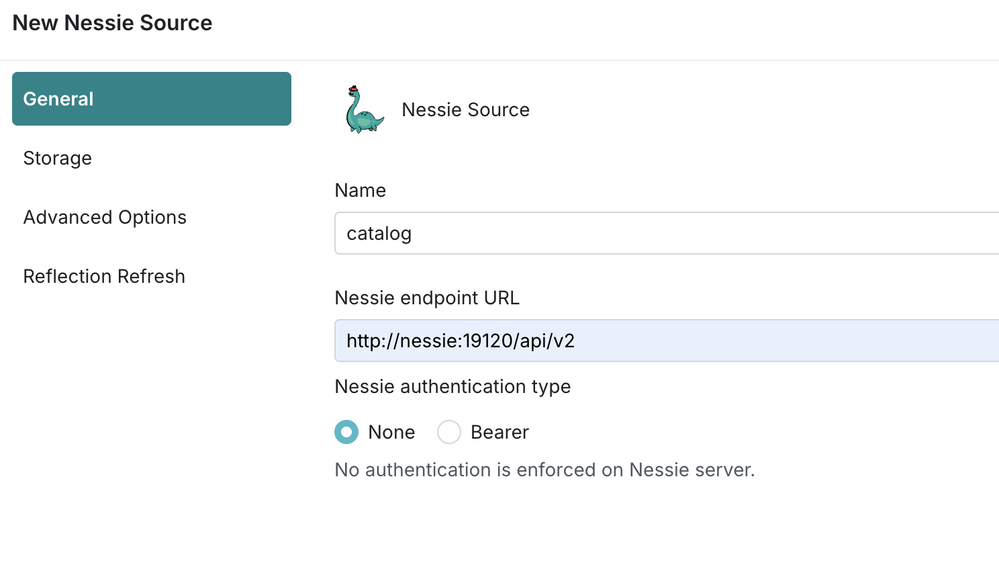

# Setting up your environment

For this tutorial, we will be creating a data lakehouse on your laptop. We will be spinning up Minio as a local data lake, using Nessie as our data catalog, and connecting these as data sources to Dremio. This may sound complicated but is easily achieved using Docker. 

As such, make sure you have Docker installed, and if using Docker Desktop you may have to make sure you have at least 6GB of memory allocated to Docker. 

## Setting up a Minio Data Lake and Nessie Catalog

First, let's spin up our services using the provided `docker-compose.yml` and with the command:

```
docker compose up
```
After a minute or two, Dremio should be up and running and we can visit it in the browser at `localhost:9047` where we will have to create our initial user account. You will need to provide:
  - First Name
  - Last Name
  - Username
  - Email
  - Password

  

Your Username and Password will be used later to connect Dremio to dbt, so please remember them.

## Connecting Our Data Sources to Dremio
Once you are inside Dremio, we can begin adding our data sources by clicking the "Add Source" button in the bottom left corner.

### Add Our Data Catalog Source
  - Select Nessie from "Add Source"
  - On the General Tab
    - name: `catalog`
    - URL: `http://nessie:19120/api/v2`
    - Nessie authentication type: `None`
  - On the Storage tab:
    - root path: `warehouse`
    - access key: `admin`
    - secret key: `password`
    - connection properties:
      - `fs.s3a.path.style.access` : `true`
      - `fs.s3a.endpoint` : `minio:9000`
      - `dremio.s3.compat` : `true`
    - Encrypt Connection: `false`

    
    

## Creating a Python Virtual Environment and Installing dbt

Dremio has its own dbt connector, called `dbt-dremio`, which we use to connect Dremio to dbt Core (connection to dbt Cloud not available at the time of writing). This package requires Python 3.9.x or later to be installed. If you do not have Python or the required version please install or update that now. You should always isolate your python dependencies by creating a virtual environment for each project.

Command to create the environment for this course:

```
python -m venv dbt-dremio
```

This will create a `dbt-dremio` folder with your virtual environment we want to run the activate script in that folder:

- Linux/Mac `source dbt-dremio/bin/activate`
- Windows (CMD) `dbt-dremio\Scripts\activate`
- Windows (powershell) `.\dbt-dremio\Scripts\Activate.ps1`

This script will update the `pip` and `python` command in your active shell to use the virtual environment not your global python environment.

Now we can install `dbt-dremio`.

```
pip install dbt-dremio
```

With that done we now have our development environment fully set up and we are ready to move onto using dbt!