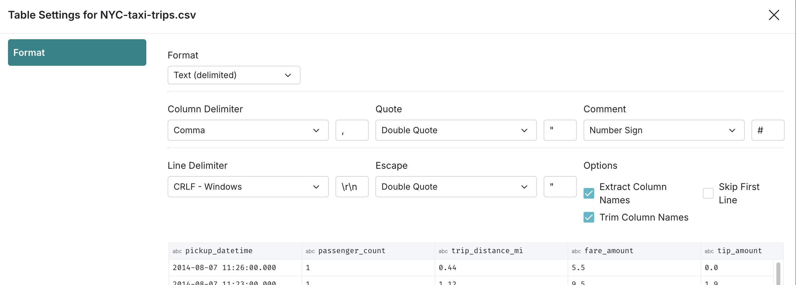

# Creating Data Models

The data transformation process using dbt + Dremio involves writing transformation logic in dbt using SQL which is executed using Dremio’s SQL engine. These SQL queries are referred to as **"models"** and are saved as .sql files. 

In this unit we will create and execute some models, starting with a raw dataset and ending with a dataset intended for business use.

## A Reference Guide of Common dbt Commands

Throughout this tutorial we will use a few select dbt commands. Below are details on them to help familiarise you. **When running any dbt command, ensure that your terminal is navigated to the folder containing your `dbt_project.yml` file.** This ensures dbt has access to the project configuration and can execute the commands successfully.

#### **Core dbt Commands**

1. **`dbt run`**
   - **Purpose**: Executes all the models defined in your project by running the SQL files and materializing the results (tables, views, or incremental models) according to the configurations.
   - **Use Case**: Use this command to build or refresh your data models in the target database.

2. **`dbt build`**

- **Purpose**: Combines multiple actions—compiling, running, testing, and building documentation—all in one command.
- **Use Case**: Use this for an end-to-end execution of models, ensuring they run, pass tests, and have documentation updated.

3. **`dbt test`**

- **Purpose**: Runs the tests defined in your tests directory or within your models to validate data quality and integrity.
- **Use Case**: Use this command to check that your data meets the defined constraints (e.g., unique values, no nulls).

#### Tips for Using dbt Commands

- Commands like `dbt run`, `dbt test`, and `dbt build` can be scoped to specific models or directories by using selectors (e.g., `dbt run --select <model_name>`).


## Create a raw source dataset in Dremio

The data used to create your models will be an Iceberg table stored in the data catalog. To create this you will be using the sample dataset `NYC-taxi-trips.csv` provided in Dremio. 

### Add Sample Data
Click on the "Add Source" button to bring up the "Add Data Source" pop-up window. In this list, under "Object Storage" select the option "Sample Source" which has Gnarly, the Dremio mascot, as its icon.

  

- Click through to `Samples."samples.dremio.com"`. 
- To [format the data to a table](https://docs.dremio.com/current/sonar/data-sources/entity-promotion/) click on the file `NYC-taxi-trips.csv`.
- In the Table Settings window that pops up, tick the box to `Extract Column Names` and click Save.

  

- In the sample data list the icon for this file will have changed from a grey file to a purple table.

Now that the dataaset is a table you generate an Iceberg table in the data catalog. Go to the SQL editor and run the following SQL statement:

```
-- Turning the CSV file into an Apache Iceberg table using CTAS
CREATE TABLE catalog.nyc.raw.trips AS SELECT * FROM Samples."samples.dremio.com"."NYC-taxi-trips.csv";
```

This code will create a main directory in the data catalog called `nyc` for your project, and within that a sub-directory one called `raw` into which it wrote an Iceberg table, `trips`. Click through into this directory in the Dremio UI to see for yourself.

<p align="center">
  
</p>

## Create sub-folders for the models

Return to your IDE and we will continue working with dbt.

Nested underneath the `models` directory create the following two directories:
 - `intermediate`
 - `marts`

At this point I also recommend to delete the `example` directory. This was auto-created with your dbt project, but we will not be using it and do not want those models to be executed.

## Create an intermediate model

- Create an .sql file called `int_trips__formatted.sql` within the `models.intermediate` directory. 
- This will take the raw data from `catalog.nyc.raw.trips` and rename and reformat the attributes.
- Use the command `dbt run` to create the view in Dremio.
- Navigate to `catalog.nyc.intermediate` in the Dremio UI to view the created view.
- Use the Dremio UI to compare this view with the raw table in `catalog.nyc.raw`.

## Create a marts model

- Create an .sql file called `nyc_taxi_gross_income.sql` within the `models.marts` directory. 
- This will use the intermediate view `int_trips__formatted` as a source and drop unwanted coloumns.
- Rather than pull data from Dremio this model uses the `ref()` function to [reference](https://docs.getdbt.com/reference/dbt-jinja-functions/ref) the intermediate model. 
- Use `dbt run` to create the view in Dremio.
- Navigate to `catalog.nyc.marts` to view the created view.